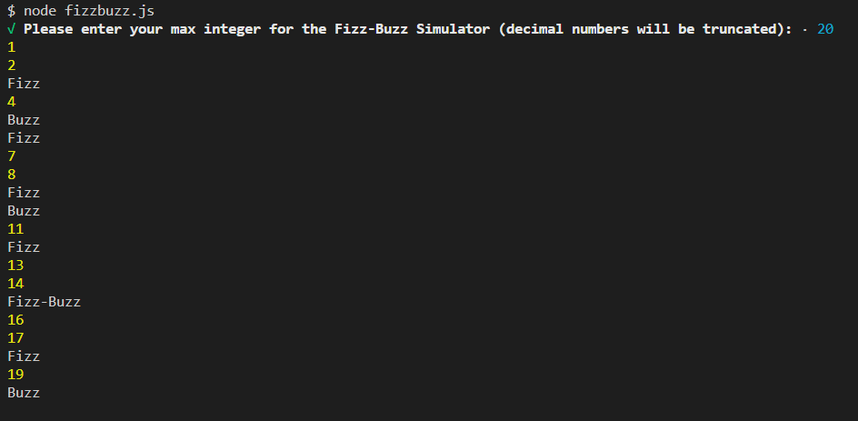

# Fizz-Buzz Game
## Description
Simple simulator of the Fizz-Buzz game.  Output "Fizz" if the number is divisible by 3, output "Buzz" if the number is divisible by 5, and output "Fizz-Buzz" if it is divisible by both 3 and 5.
## Method
Utilized a simple for loop with if/else checks and the Enquirer node package for the user input of max desired number to play to.
## Installation
npm i
## To Run
node fizzbuzz.js
## Questions
Contact the author with questions via GitHub or email at

[JonPointer at GitHub](https://github.com/JonPointer) jonpointer@msn.com
## Screenshot

